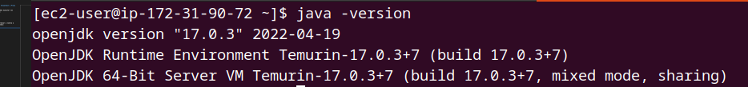
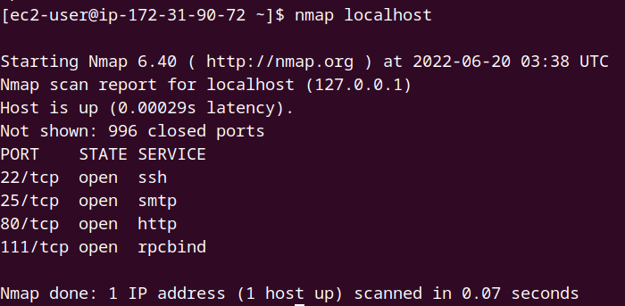
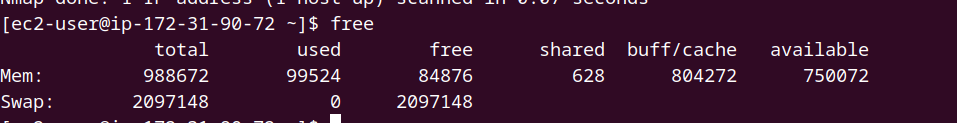

# Repositorio para la prueba de concepto de Vitualhost y Proxy Reverso

En una instancia basada en Amazon Linux, clonar el proyecto actual y ejecutar los siguientes comandos para instalación básica:

`
wget https://raw.githubusercontent.com/vacax/virtualhost-proxyreverso/master/basico.sh && chmod +x basico.sh && bash basico.sh && git clone https://github.com/vacax/virtualhost-proxyreverso && cd virtualhost-proxyreverso
`

Una vez terminado el script, salga de la terminar y vuelva a conectarse. Validar que los siguientes comandos:

**Comando Java:**

`
java -version
`

**Comando Nmap:**

`
nmap localhost
`

**Comando Free:**

`
free 
`

En este punto tenemos disponible todas las herramientas necesarias instaladas.

