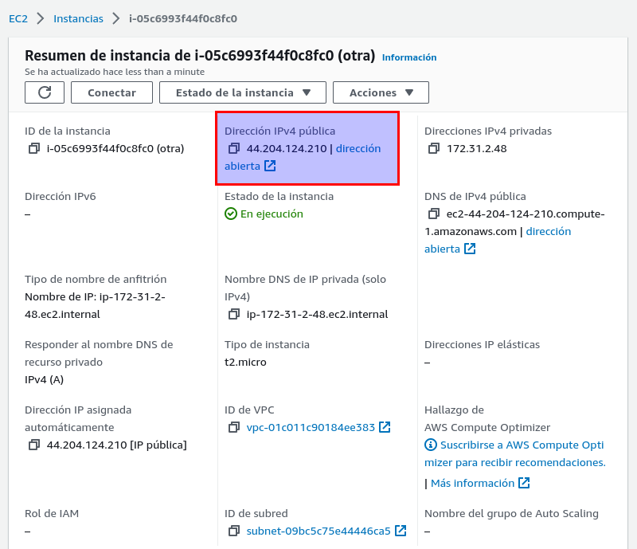
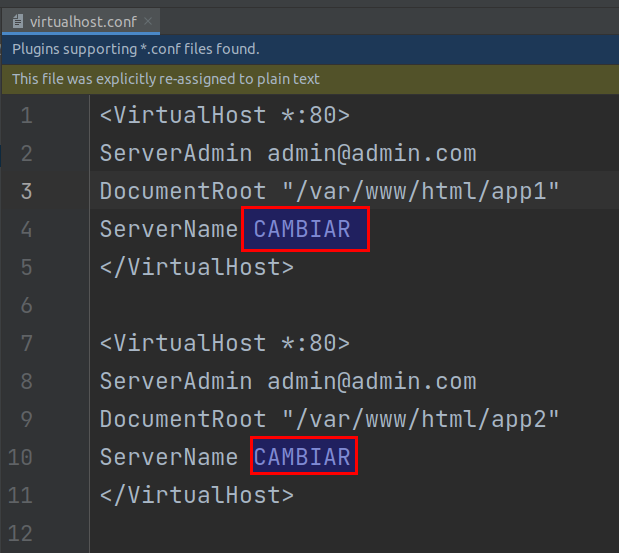
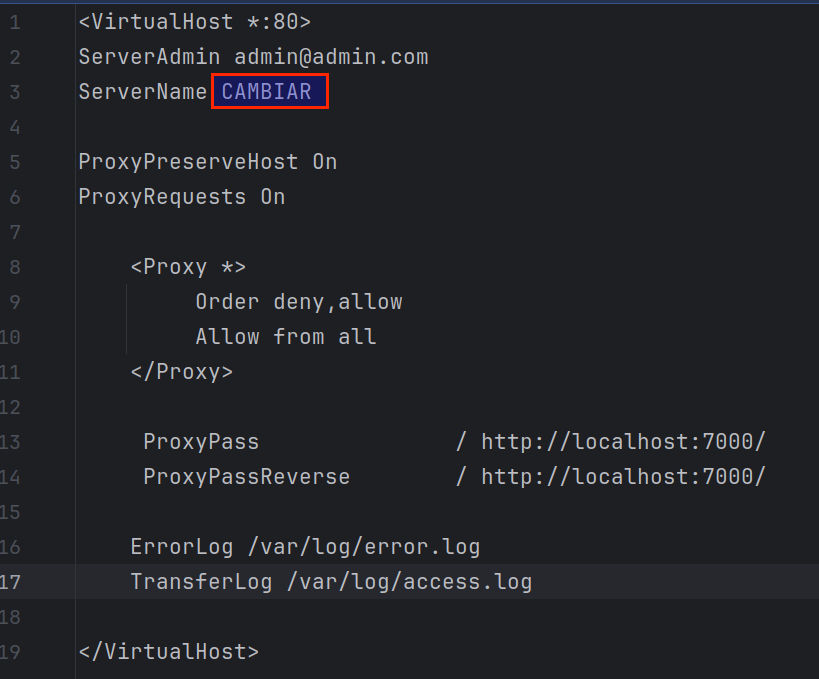
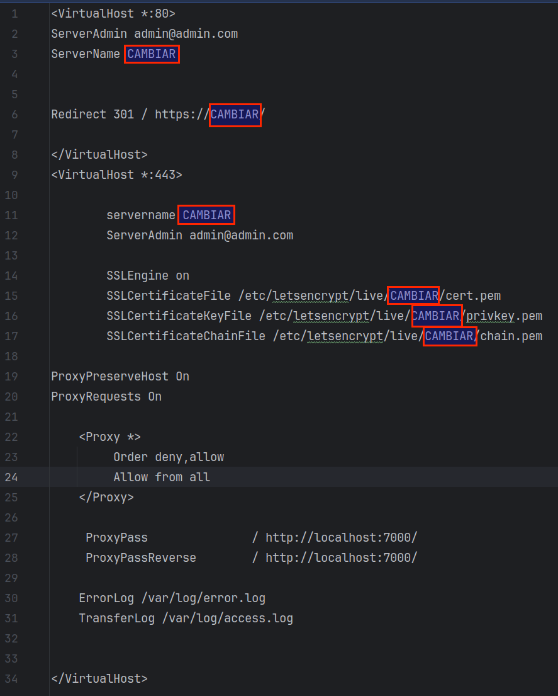

# Repositorio para la prueba de concepto de Vitualhost y Proxy Reverso

En una instancia basada en Amazon Linux, clonar el proyecto actual y ejecutar los siguientes comandos para instalación básica:

### Ubuntu:

`
wget https://raw.githubusercontent.com/vacax/virtualhost-proxyreverso/master/basico-ubuntu.sh && chmod +x basico-ubuntu.sh && bash basico-ubuntu.sh
`

### Amazon Linux 2:
`
wget https://raw.githubusercontent.com/vacax/virtualhost-proxyreverso/master/basico.sh && chmod +x basico.sh && bash basico.sh
`

Una vez terminado el script, salga de la terminar y vuelva a conectarse. Validar que los siguientes comandos:

**Comando Java:**

`
java -version
`


**Comando Nmap:**

`
nmap localhost
`


**Comando Free:**

`
free 
`


En este punto tenemos disponible todas las herramientas necesarias instaladas.

### **Configurando Virtualhost**

Es necesario contar con un servicio DNS, para poder registrar los registro tipo A, 
apuntando a la dirección IP de la máquina asignada en Amazon. En el archivo ``virtualhost.conf`` 
en la ruta de ``/etc/apache2/sites-available/``, deben cambio el valor ``CAMBIAR`` por la IP, ver imágenes.





Una vez modificado ejecutar el comando: 
```
sudo service apache2 reload
```

### **Configurando Proxy Reverso**

Ver el archivo ``/etc/apache2/sites-available/proxyreverso.conf``, y sustituir el valor ``CAMBIAR``. Ver imagen.



Una vez modificado ejecutar el comando:
```
sudo service apache2 reload
```

### **Configurando Proxy Reverso y Seguridad**

Ver el archivo ``/etc/apache2/sites-available/seguro.conf``, y sustituir el valor ``CAMBIAR``. Ver imagen.



Una vez modificado ejecutar el comando:
```
sudo service apache2 reload
```